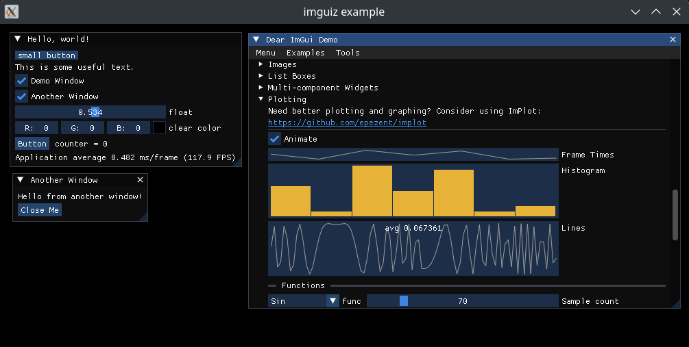

# imguiz

- Provides imgui and SDL3 (statically linked) to your Zig application.
- [dear_bindings](https://github.com/dearimgui/dear_bindings) to use [imgui](https://github.com/ocornut/imgui) (docking branch) in [zig](https://ziglang.org/)
- Currently only SDL3 and Vulkan are supported, but it should be easy to update by modifying the following to add imgui backends.
  - `#include` directives in `./src/imguiz.h`
  - `module.addCSourceFile` invocations in `./build.zig`



### Library

imguiz exposes a module that can be used in your project.

```sh
zig fetch --save git+https://github.com/mgerb/imguiz
```

```zig
// build.zig
const imguiz = b.dependency("imguiz", .{
    .target = target,
    .optimize = optimize,
    // Optionally enable FreeType font rasterization. It is compiled by Zig and statically linked.
    // https://github.com/ocornut/imgui/blob/master/misc/freetype/README.md
    .freetype = true,
});
exe.root_module.addImport("imguiz", imguiz.module("imguiz"));
```

```zig
// main.zig
const std = @import("std");
const imguiz = @import("imguiz").imguiz;

pub fn main() !void {
    std.debug.print("{s}\n", .{imguiz.ImGui_GetVersion()});
}
```

### Generator

All bindings are in `./generated`. They are pinned to the versions at the top of `./src/main.zig`.

- [imgui](https://github.com/ocornut/imgui) (docking)
- [dear_bindings](https://github.com/dearimgui/dear_bindings) (master)

```sh
nix develop -c zig build run -Dgenerate
```

The generator does the following:

- Clones [dear_bindings](https://github.com/dearimgui/dear_bindings) to `./tmp`.
- Clones [imgui](https://github.com/ocornut/imgui) to `./tmp`.
- Executes `./tmp/dear_bindings/BuildAllBindings.sh`.
- Copies all required C bindings to `./generated`, which can be natively included in Zig.

### Example

See a more in depth example using [vulkan-zig](https://github.com/Snektron/vulkan-zig) in `./example`.

```sh
cd example
nix develop -c zig build run
```

**Note:** Only tested on NixOS, but should work on any flavor of Linux with the [nix](https://nixos.org/download/)
package manager.
