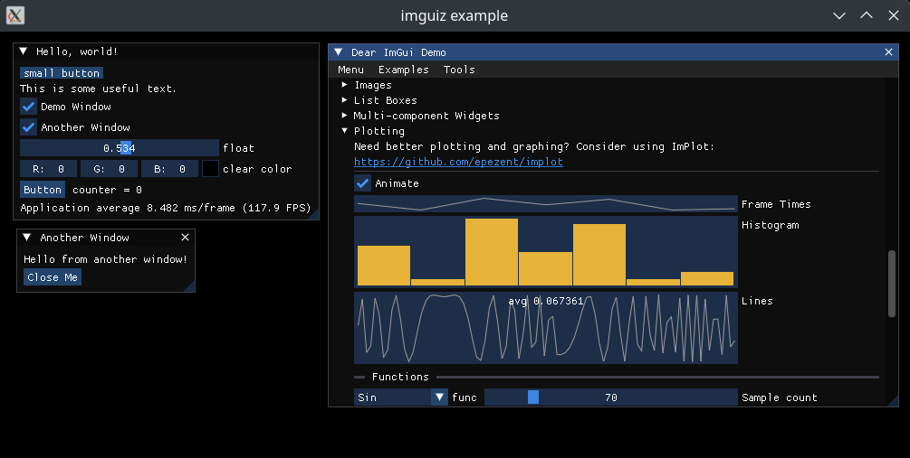

# imguiz

- [dear_bindings](https://github.com/dearimgui/dear_bindings) to use [imgui](https://github.com/ocornut/imgui) (docking branch) in [zig](https://ziglang.org/)
- currently only SDL3 and Vulkan are supported, but it should be easy to update by modifying the following to add imgui backends
  - `@cInclude` in `./src/imguiz.zig`
  - `module.addCSourceFile` invocations in `./build.zig`



### Library

imguiz exposes a module that can be used in your project.

```sh
zig fetch --save git+https://github.com/mgerb/imguiz
```

```zig
// build.zig
...
const imguiz = b.dependency("imguiz", .{});
exe.root_module.addImport("imguiz", imguiz.module("imguiz"));
...
```

```zig
// main.zig
const std = @import("std");
const imguiz = @import("imguiz");

pub fn main() !void {
    std.debug.print("{s}\n", .{imguiz.ImGui_GetVersion()});
}
```

### Generator

All bindings are in `./generated`. I will update them from the following branches as needed.

- [imgui](https://github.com/ocornut/imgui) (docking)
- [dear_bindings](https://github.com/dearimgui/dear_bindings) (master)

```sh
nix develop # This is optional if you want to manually install dependencies (zig, python>=3.12, python ply package)
zig build run -Dgenerate
```

The generator does the following

- clones [dear_bindings](https://github.com/dearimgui/dear_bindings) to `./tmp`
- clones [imgui](https://github.com/ocornut/imgui) to `./tmp`
- executes `./tmp/dear_bindings/BuildAllBindings.sh`
- copies all required C bindings to `./generated`, which can be natively included in zig

### Example

See a more in depth example using [vulkan-zig](https://github.com/Snektron/vulkan-zig) in `./example`.

```sh
cd example
nix develop # nix package manager makes this easy: https://nixos.org/download/
zig build run
```

**Note:** Only tested on NixOS, but should work on any Linux distro with the [nix](https://nixos.org/download/)
package manager, or the right dependencies installed (zig, vulkan sdk, vulkan validation layers, sdl3).
